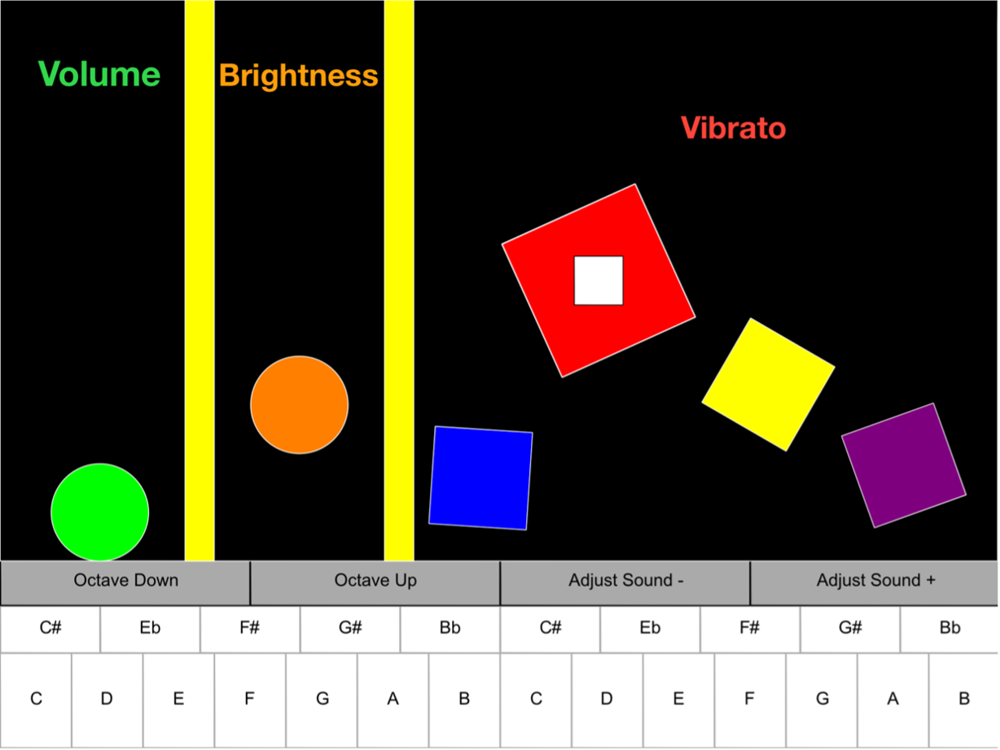

# PhysiBoard
Physics Based iPadOS Keyboard Instrument.
Written in 2022 as coursework for the iOS Programming for Audio third year module at the University of York. 

More recently it is being ported to iOS for iPhone.

- Jonathan Cooke
  (25/11/2024)

=====================================================

PhysiBoard has been written using Xcode (13.4.1), for iPad OS 15.7. Developed using an iPad 9th Generation.

Apple iOS Frameworks:
• SpriteKit (including the built-in physics engine)
• UIKit (To host the SpriteKit window)

Third-Party Frameworks:
• AudioKit (5.2.2) https://github.com/AudioKit/AudioKit/releases/tag/v5.2.2

AudioKit published under the MIT License.
https://github.com/AudioKit

## Video Demonstration
https://youtu.be/fRnqj8or5o0?si=J7APSFFjQyHSSDbf

## Mock App Store Description

App Name: PhysiBoard

App Description:

PhysiBoard is a physics based sound toy, that’s also a bit like a keyboard. 

There are boxes, balls and walls. Moving the green and orange balls, and the red spinning square changes the sound of the keyboard. The other boxes are just there for fun.

Physics Controls
• Green ball height controls volume.
• Orange ball height controls brightness.
• Red box spin speed controls vibrato.
• Slide the red box sideways to make the vibrato larger!
• Use the extra boxes to change how the other objects behave.

Keyboard
• Two octaves containing the same notes as a normal keyboard.
• Slide your fingers across the rows!
• Octave and sound adjust buttons.

There are no rules, play with PhysiBoard your own way!

- PhysiBoard is a real synthesiser which uses Frequency Modulation (FM) synthesis.

- Future updates coming with more physics sandboxes!

- Need help or support? Get in touch with our customer service team at jac696@york.ac.uk

Primary Category: Game
Secondary Category: Music

Subcategories: Music, Simulation

App Rating: 4+
